# Project Gantt - Session 20 (2026-01-25)

> Generated from task analysis. Critical paths identified for autonomous worker delegation.

## Resource Budget Today
- **Online Fights**: ~40 remaining (PRECIOUS)
- **Offline Simulation**: Unlimited (BLOCKED by #26)
- **Test Scenario API**: Unlimited (working)

---

## Critical Path Analysis

### Path A: Simulator Unblock (HIGHEST PRIORITY)
```
#26 Simulator weapons ──┬──> #37 Adaptive counter validation
     [IN PROGRESS]      │
                        ├──> #34 AI strategy optimization
                        │
                        ├──> #73 stat_cv vs duration
                        │
                        └──> #74 Mid-game efficiency
```
**Bottleneck**: #26 blocks ALL offline AI testing. Fix this first.

### Path B: Data-Driven Strategy
```
#73 stat_cv correlation ──> #74 Mid-game efficiency ──> #34 AI optimization
     [NEW]                    [NEW]                       [PENDING]
```
**Insight**: PONR data shows Turn 7-18 decisions matter. Build sustained AI.

### Path C: Operations & XP
```
#57 Garden automation ──┬──> #63 Battle Royale
     [PENDING]          │
                        └──> Level-up acceleration
```
**Free fights**: 10/day Battle Royale + garden = passive XP.

### Path D: Tournament Path (Deferred)
```
#16 Tournament API ──> #59 Tournament automation ──> Ranking points
     [PENDING]            [PENDING]
```
**Value**: Tournament wins = faster ranking climb.

---

## Gantt Timeline (Mermaid)

```mermaid
gantt
    title Priap.OS Critical Path - Session 20
    dateFormat HH:mm
    axisFormat %H:%M

    section Simulator Fix
    #26 Debug weapons    :crit, active, a1, 00:00, 2h
    #66 Add tests        :a2, after a1, 1h

    section AI Strategy
    #37 Adaptive counter :b1, after a1, 2h
    #73 stat_cv analysis :b2, after a1, 1h
    #74 Mid-game opt     :b3, after b2, 2h

    section Data Analysis
    Scrape L100-300      :c1, 00:00, 4h
    PONR elite verify    :c2, after c1, 1h

    section Operations
    #57 Garden auto      :d1, 01:00, 1h
    #63 Battle Royale    :d2, after d1, 2h
```



---

## Task Strands for Worker Delegation

### Strand 1: Simulator Fix (#26) - CRITICAL
**Autonomous**: YES
**Complexity**: Medium
**Files**: `src/leekwars_agent/simulator.py`, `scripts/validate_archetypes.py`

```markdown
## Task: Fix Simulator Weapon Attacks (#26)

**Problem**: ALL simulated fights timeout at turn 65, 0 damage dealt.

**Investigation**:
1. Read `src/leekwars_agent/simulator.py` - check EntityConfig weapon setup
2. Read Java generator source for weapon loading
3. Add debug logging to trace useWeapon() calls
4. Compare entity config with online fight replay data

**Success Criteria**:
- Simulated fights deal damage
- useWeapon() returns USE_SUCCESS
- A/B tests produce meaningful results (not all draws)

**Commit after each milestone.**
```

### Strand 2: stat_cv vs Duration Analysis (#73)
**Autonomous**: YES
**Complexity**: Low
**Files**: `src/leekwars_agent/scraper/db.py`, analysis scripts

```markdown
## Task: Validate stat_cv vs Fight Duration (#73)

**Hypothesis**: Pure STR (stat_cv=0.94) may win in long fights.

**Steps**:
1. Query fights_light.db for fights with duration + winner
2. Join with alpha_strike_metrics for stat_cv
3. Correlate: win_rate vs stat_cv, segmented by duration
4. Write findings to `docs/research/stat_cv_duration.md`

**Success Criteria**:
- Clear correlation (or disproof) documented
- Statistical significance noted (n > 100 per bucket)
```

### Strand 3: Battle Royale Automation (#63)
**Autonomous**: YES
**Complexity**: Medium
**Files**: `src/leekwars_agent/api.py`, `tools/leek-wars/src/`

```markdown
## Task: Battle Royale WebSocket Automation (#63)

**Value**: 10 free fights/day, no quota burn.

**Steps**:
1. Study `tools/leek-wars/src/component/battle-royale/` for WebSocket protocol
2. Implement BR join/spectate in api.py
3. Add CLI command `leek br join`
4. Test manually first

**Success Criteria**:
- Can join Battle Royale via CLI
- Fights run without manual intervention
```

### Strand 4: Garden Fight Automation (#57)
**Autonomous**: YES
**Complexity**: Low
**Files**: `src/leekwars_agent/api.py`, endpoint already discovered

```markdown
## Task: Garden Fight Automation (#57)

**Value**: Free XP from garden fights.

**Steps**:
1. Implement `garden/start-solo-fight` endpoint (already discovered)
2. Add CLI command `leek garden fight`
3. Integrate into daily automation script

**Success Criteria**:
- Can run garden fights via CLI
- Integrated into `auto_daily_fights.py`
```

---

## Priority Matrix (Updated 18:30)

| Priority | Task | Status | Worker? | Est. Time |
|----------|------|--------|---------|-----------|
| **P0** | #26 Simulator fix | ROOT CAUSE FOUND | **ASSIGN NOW** | 1h |
| ~~P1~~ | ~~#73 stat_cv~~ | ✅ DONE | - | - |
| P2 | #57 Garden auto | Ready | YES | 1h |
| P2 | #63 Battle Royale | Ready | YES | 2h |
| P3 | #37 Adaptive counter | Blocked by #26 | AFTER #26 | 2h |
| P3 | #74 Mid-game opt | Unblocked | YES | 2h |

---

## Today's 40 Fights Strategy

With PONR insights (Turn 7-18 matters), our 40 fights should:

1. **Collect duration data**: Log turn count per fight
2. **Track mid-game TP efficiency**: Are we wasting TP in turns 5-10?
3. **Note opponent archetypes**: Aggro still dominates at L36?

**Do NOT**:
- Test unvalidated AI changes (simulator broken)
- Burn fights without logging
- Rush deployment without offline validation

---

## Session Goals

1. **Fix #26** (simulator) - Unblock everything
2. **Complete #73** (stat_cv analysis) - Validate our build
3. **Deploy #63 or #57** (free fights) - Passive income
4. **Run 40 fights with enhanced logging** - Data collection

If simulator fixed: A/B test #74 (mid-game efficiency) offline before deploying.
